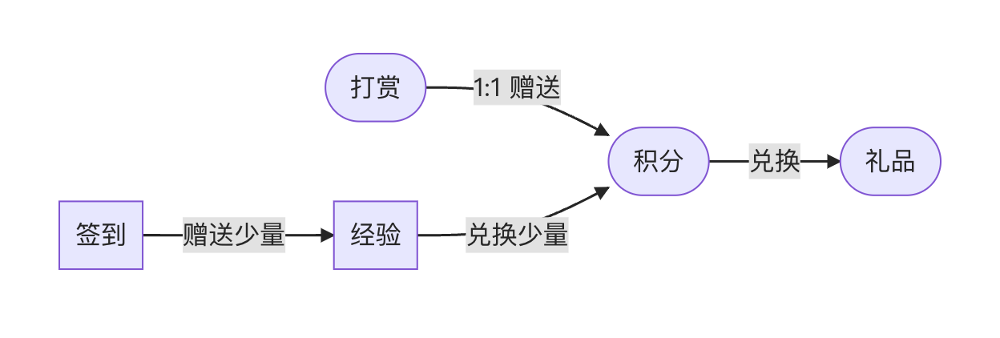

## 主题介绍

Somnia 主题是一款基于 `nvPress` 的 `扁平` 风格博客主题，由 [SCOTT Studio](https://blog.scott-studio.cn) 开发，为博客提供了独特的视觉和使用体验。

<Cards>

<Card icon={<CpuIcon className="text-purple-300" />} title='主题宗旨'>

让  没有营业销售权限的个人博主 通过：**小额打赏送积分 → 积分换礼品** 的方式来与访问者进行交互。

</Card>

<Card icon={<PanelsTopLeft className="text-blue-300" />} title='基本要求'>

务必在 **网站后台/设置/用户** 启用 **用户注册** 来允许用户与网站的交互能力。

</Card>

</Cards>

### 版本介绍

Somnia主题现分为三个版本，包含`Somnia Simple`、`Somnia Lite`、`Somnia Pro`。基础版可免费使用，只包含基础博客功能。

- Somnia Simple：只包含基础的博客功能，不允许注册登录，无用户中心
- Somnia Lite：包含基础的博客功能，允许注册登录，用户中心不包含以下功能：积分充值、VIP、互动礼物、礼品兑换、付费阅读、社区徽章、社区等级、第三方登录
- Somnia Pro：包含所有功能的完整版主题。

### 交互方式

## 主题效果

主题效果请访问开发者本人的博客站点：[SCOTT Studio](https://blog.scott-studio.cn)

## 获取主题

<Callout title="打赏送主题">
  向开发者（QQ：2406177615）打赏指定金额，作为打赏回礼，将赠送此主题给您使用 
	<small> 加开发者QQ时，请备注：打赏送主题</small>
</Callout>

<Callout title="赠品须知">

 - 赠送回礼时，开发者将与您约定一个您拥有的域名，此主题只能安装在此域名下。域名不可变更
 - 赠品不得分享到任何地方，只允许打赏者本人使用
 - 赠品是打赏时的最新版，若未来有版本更新，也将提供给您

</Callout>

